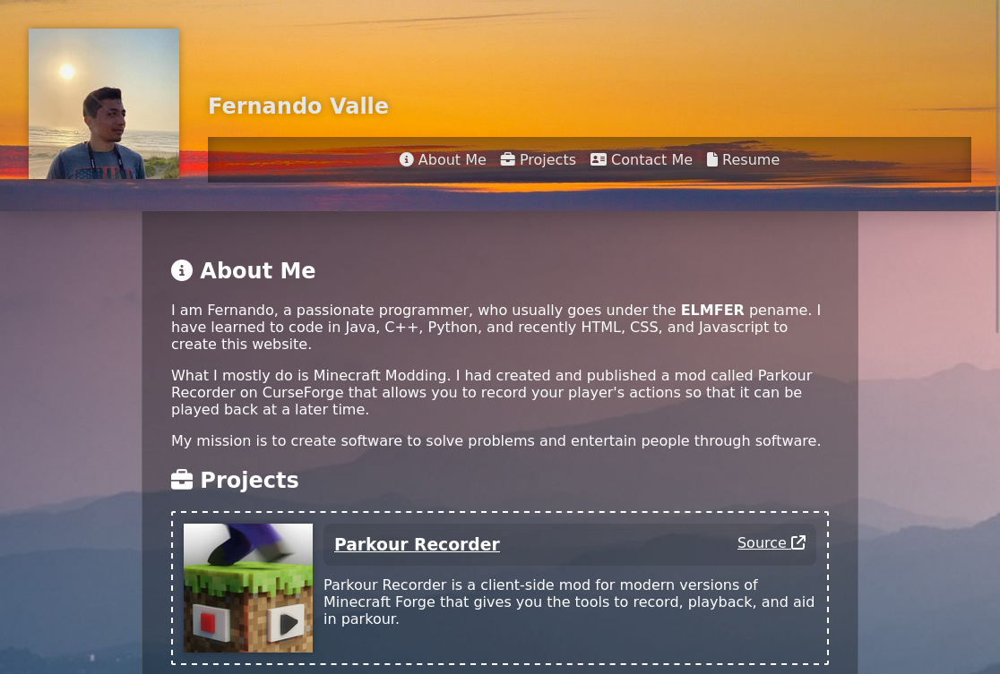

# React Portfolio

 
 
My portfolio website built with the React framework. This allowed me to learn how to use React to compartmentalize repetitive components that becomes useful in big applicaitons.

Screenshot:

## Table Of Contents
1. [Installation](#installation)
2. [Usage](#usage)
3. [License](#license)
4. [Contributing](#contributing)
5. [Tests](#tests)
6. [Questions](#questions)
 
### Installation
 
Be sure to have NodeJS v18.18.0 or greater installed. Clone the repository. Once cloned, install all the dependencies by running `npm install`.  
 
### Usage
 
Access the homepage at `/`, so this will display all the content of each page at once. Access the about page at `/about`; this will show my background and reason for pursuing programming. Access the projects page at `/projects` to see the list of personal and contributed projects of mine. Access the `/contact` page to view my contacts in case you want to network with me. You may also access those pages by clicking the links in the navbar at top of every page. To access the homepage, simply click my picture at the top-left, or click my name beside my picture.
 
### License
 
 

This project in under the MIT license. Learn more about it here: https://opensource.org/licenses/MIT
 
### Contributing
 
N/A
 
### Tests
 
N/A
 
### Questions
 
What is the link to my GitHub?
 
- Link to my GitHub profile: [https://github.com/elmfer](https://github.com/elmfer)
 
How can you contact me?
 
- Contact me through my email: [elmfer10@gmail.com](mailto:elmfer10@gmail.com)
